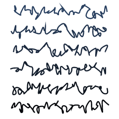
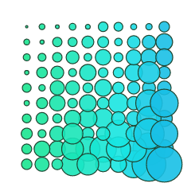

## Reference

- [Metadata](#Metadata)
- [Drawing](#Drawing)
- [Drawable](#Drawable)
- [Control Flow](#Control-Flow)
- [Randomness](#Randomness)



### Metadata

Get metadata on the drawing surface.

```typescript
meta: {
  top: number
  bottom: number
  right: number
  left: number
  aspectRatio: number
  center: [number, number]
}
```

### Drawing

Set line width

```typescript
lineWidth: number
```

Line style (standard Canvas options)

```typescript
lineStyle: {
    cap?: "round" | "butt" | "square";
};
```

Fill the background. Colour is always via hsl(a). No more ##RRGGBB that is for computers not humans.

```typescript
background(h: number, s: number, l: number, a?: number): void;
```

Fill the background with a gradient (either linear or radial). See LinearGradient and RadialGradient which provide nice ways to specify the gradients.

```typescript
backgroundGradient(gradient: Gradientable): void;
```

Set the 'pen' colour.

```typescript
setStrokeColour(h: number, s: number, l: number, a?: number): void;
```

Set the fill colour.

```typescript
setFillColour(h: number, s: number, l: number, a?: number): void;
```

Set the pen gradient.

```typescript
setStrokeGradient(gradient: Gradientable): void;
```

Set the fill gradient.

```typescript
setFillGradient(gradient: Gradientable): void;
```

Draw a line (deprecated). Typelates ues `[number, number] (Point2D)` for all points.

```typescript
drawLine(from: Point2D, to: Point2D): void;
```

Draw (lines on) something.

```typescript
draw(traceable: Traceable): void;
```

Fill something.

```typescript
fill(traceable: Traceable): void;
```

Outline text.

```typescript
drawText(config: TextConfig, text: string): void;
```

Solid text.

```typescript
fillText(config: TextConfig, text: string): void;
```

### Drawable

The first (attempt at being a) innovative area of Typeplates is in the drawing APIs. Instead of awkward, low level HTML Canvas APIs we have nicer, more declarative, more agile and more human APIs.

Curves in particular should make more sense. And there are convenience operations on sets of points (smoothing with the Chaiken algorithm) and Rectanges (splitting into smaller rectangles).

The core drawing objects are listed below. For basic paths (a series of points):

```typescript
SimplePath implements Traceable
```

For complex paths (with curves):

```typescript
Path implements Traceable
```

For arcs (partial circles):

```typescript
Arc implements Traceable
```

For rectangles:

```typescript
Rect implements Traceable
```

For circles and ellipses:

```typescript
Ellipse implements Traceable
```

See the `implements Traceable` bit, yeah, you can do that for custom drawing. It exposes the low level HTML Canvas operations in a simple way. You should assume it will get called in this way (or equivalent for filling) and `ctx` is a 2D Canvas context:

```typescript
  draw(traceable: Traceable) {
    this.ctx.beginPath();
    traceable.traceIn(this.ctx);
    this.ctx.stroke();
  }
```

### Control Flow

The second innovative area of Typeplates is in bringing into the framework control flow relevant to drawing. We can easily iterate across the canvas, add a margin and so without writing boilerplate. We can even compose these with operations to build data or randomise the order.

2D tiling across the canvas. The type optional parameter allows for square tiles (with adjusted margin) or proportionate tiling.

```typescript
forTiling: (config: {
  n: number;
  type?: "square" | "proportionate";
  margin?: number;
}, callback: (point: [number, number], delta: [number, number]) => void) => void;
```

Horizontal tiling across the canvas.

```typescript
forHorizontal: (config: {
  n: number;
  margin?: number;
}, callback: (point: [number, number], delta: [number, number], i: number) => void)
  => void;
```

Horizontal tiling down the canvas.

```typescript
forVertical: (config: {
  n: number;
  margin?: number;
}, callback: (point: [number, number], delta: [number, number], i: number) => void)
  => void;
```

Take an existing control flow operation and build an array out of the results of the callbacks.

```typescript
build: <C, T extends any[], U>(iterFn: (config: C, callback: (...args: T) => void)
=> void, config: C, cb: (...args: T) => U) => U[];
```

Take an existing control flow operation and do it in a random order.

```typescript
withRandomOrder<C, T extends any[]>(iterFn: (config: C, callback: (...args: T) =>
  void) => void, config: C, cb: (...args: T) => void): void;
```

Do something a proportion of times e.g. `0.5` means half the time.

```typescript
doProportion(p: number, callback: () => void): void;
```

Do something `n` times.

```typescript
times(n: number, callback: (n: number) => void): void;
```

Iterate around a circle.

```typescript
aroundCircle: (config: {
  cX?: number;
  cY?: number;
  radius?: number;
  n: number;
}, callback: (point: [number, number], i: number) => void) => void;
```

Give proportions and callbacks. Randomly choose an option, weighted by the proportion.

```typescript
proportionately<T>(cases: [number, () => T][]): T;
```

Pick a random point within the canvas.

```typescript
randomPoint: Point2D
```

Do something over a range (don't use for loops!)

```typescript
range(config: {
  from: number;
  to: number;
  n: number;
  inclusive?: boolean;
}, callback: (n: number) => void): void;
```

Is a point in the drawing?

```typescript
inDrawing: (point: [number, number]) => boolean
```

### Randomness

A pseudorandom number

```typescript
random: () => number
```

A random integer.

```typescript
uniformRandomInt: (config: {
  from?: number
  to: number
  inclusive?: boolean
}) => number
```

-1/1 (flip a coin).

```typescript
randomPolarity: () => 1 | -1
```

Pick an item in an array at random.

```typescript
sample: <T>(from: T[]) => T
```

Pick n times from an array.

```typescript
samples: <T>(n: number, from: T[]) => T[];
```

Shuffle an array.

```typescript
shuffle: <T>(items: T[]) => T[];
```

Randomly perturb a point.

```typescript
perturb: (
  [x, y]: [number, number],
  config?: {
    magnitude?: number
  }
) => [number, number]
```

A Gaussian pseudo-random number.

```typescript
gaussian: (config?: { mean?: number; sd?: number }) => number
```

A Poisson pseudo-random number.

```typescript
poisson: (lambda: number) => number
```


